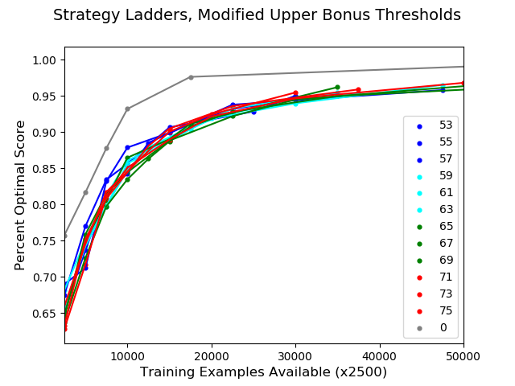

# YahtzeeLearning
An algorithmic attempt to make the game of Yahtzee more interesting

How does one characterize the depth of a game? We can address the issue through the lens of steady progress: as an agent learns the ropes, he, she, or it may find it desirable to steadily improve. A good game is arguably a) one that offers a clear path to becoming more skilled and b) does so in a more or less linear fashion. We can formalize this relationship as strategy ladder, an idea originally proposed by [Lantz et al](https://aaai.org/ocs/index.php/WS/AAAIW17/paper/download/15142/1478).

Here, I attempt to probe the shape of Yahtzee's strategy ladder via reinforcement learning. Can varying the upper bonus threshold and/or value bring about a more gradual curve?

Results are currently noisy, but with a bit more compute power a clearer relationship should emerge.

Contents:

* yahtzee.py
	* Program that determines how well a neural network can learn to play variant y of Yahtzee from a limited set of training examples generated for y.

* query_optimal_fast.py
 	* Stand-alone program that computes the optimal strategy for a given variant of Yahtzee

* query_optimal.py
	* Slower, but more organized implementation of query_optimal_fast

Usage: run [program] -help for a list of command-line arguments